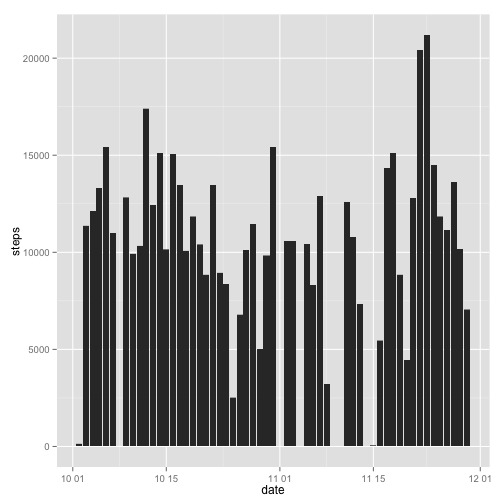
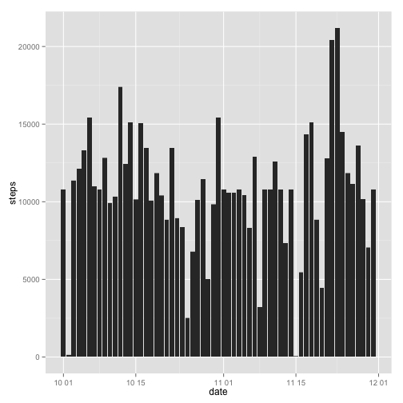
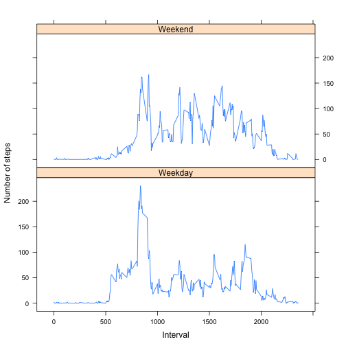

# Reproducible Research: Peer Assessment 1

## Loading and preprocessing the data

```r
amd <- read.table("activity.csv", header=TRUE, sep=",", na.strings="NA")
amd$date <- as.Date(amd$date)
```

## What is mean total number of steps taken per day?
- Make a histogram of the total number of steps taken each day

```r
library(ggplot2)
attach(amd)
qplot(date, steps, geom="bar", stat="identity")
```

```
## Warning: Removed 2304 rows containing missing values (position_stack).
```

 

```r
detach(amd)
```
- Calculate and report the mean and median total number of steps taken per day

```r
library(sqldf)
```

```
## Loading required package: gsubfn
## Loading required package: proto
```

```
## Warning: couldn't connect to display ":0"
```

```
## Loading required package: RSQLite
## Loading required package: DBI
## Loading required package: RSQLite.extfuns
```

```r
final<-amd[complete.cases(amd$steps),]
newtab <- sqldf("select sum(steps) as sum_steps, avg(steps) as avg_steps, date from final group by date")
```

```
## Loading required package: tcltk
```

```r
newtab
```

```
##    sum_steps avg_steps       date
## 1        126    0.4375 2012-10-02
## 2      11352   39.4167 2012-10-03
## 3      12116   42.0694 2012-10-04
## 4      13294   46.1597 2012-10-05
## 5      15420   53.5417 2012-10-06
## 6      11015   38.2465 2012-10-07
## 7      12811   44.4826 2012-10-09
## 8       9900   34.3750 2012-10-10
## 9      10304   35.7778 2012-10-11
## 10     17382   60.3542 2012-10-12
## 11     12426   43.1458 2012-10-13
## 12     15098   52.4236 2012-10-14
## 13     10139   35.2049 2012-10-15
## 14     15084   52.3750 2012-10-16
## 15     13452   46.7083 2012-10-17
## 16     10056   34.9167 2012-10-18
## 17     11829   41.0729 2012-10-19
## 18     10395   36.0938 2012-10-20
## 19      8821   30.6285 2012-10-21
## 20     13460   46.7361 2012-10-22
## 21      8918   30.9653 2012-10-23
## 22      8355   29.0104 2012-10-24
## 23      2492    8.6528 2012-10-25
## 24      6778   23.5347 2012-10-26
## 25     10119   35.1354 2012-10-27
## 26     11458   39.7847 2012-10-28
## 27      5018   17.4236 2012-10-29
## 28      9819   34.0938 2012-10-30
## 29     15414   53.5208 2012-10-31
## 30     10600   36.8056 2012-11-02
## 31     10571   36.7049 2012-11-03
## 32     10439   36.2465 2012-11-05
## 33      8334   28.9375 2012-11-06
## 34     12883   44.7326 2012-11-07
## 35      3219   11.1771 2012-11-08
## 36     12608   43.7778 2012-11-11
## 37     10765   37.3785 2012-11-12
## 38      7336   25.4722 2012-11-13
## 39        41    0.1424 2012-11-15
## 40      5441   18.8924 2012-11-16
## 41     14339   49.7882 2012-11-17
## 42     15110   52.4653 2012-11-18
## 43      8841   30.6979 2012-11-19
## 44      4472   15.5278 2012-11-20
## 45     12787   44.3993 2012-11-21
## 46     20427   70.9271 2012-11-22
## 47     21194   73.5903 2012-11-23
## 48     14478   50.2708 2012-11-24
## 49     11834   41.0903 2012-11-25
## 50     11162   38.7569 2012-11-26
## 51     13646   47.3819 2012-11-27
## 52     10183   35.3576 2012-11-28
## 53      7047   24.4688 2012-11-29
```

## What is the average daily activity pattern?
- Make a time series plot (i.e. type = "l") of the 5-minute interval (x-axis) and the average number of steps taken, averaged across all days (y-axis)

```r
dap <- sqldf("select avg(steps) as avg_int_steps, interval from final group by interval")
plot(dap$interval, dap$avg_int_steps, type="l", xlab="5-minute interval", ylab="Average number of steps taken")
```

 
-Which 5-minute interval, on average across all the days in the dataset, contains the maximum number of steps?

```r
max(dap$avg_int_steps)
```

```
## [1] 206.2
```

## Imputing missing values
- Calculate and report the total number of missing values in the dataset 

```r
sum(!complete.cases(amd$steps))
```

```
## [1] 2304
```
- Devise a strategy for filling in all of the missing values in the dataset. 
- Create a new dataset that is equal to the original dataset but with the missing data filled in.

```r
line <- nrow(amd)
length <- nrow(dap)
for (i in 1:line){
        if (is.na(amd$steps[i])){
                for (j in 1:length){
                        if (amd$interval[i]==dap$interval[j])
                                break
                }
                amd$steps[i] <- dap[j,1]
        }
}
newamd <- amd
amd <- read.table("activity.csv", header=TRUE, sep=",", na.strings="NA")
```
- Make a histogram of the total number of steps taken each day and Calculate and report the mean and median total number of steps taken per day.

```r
attach(newamd)
qplot(date, steps, geom="bar", stat="identity")
```

 

```r
detach(newamd)
newtab2 <- sqldf("select sum(steps) as sum_steps, avg(steps) as avg_steps, date from newamd group by date")
newtab2
```

```
##    sum_steps avg_steps       date
## 1      10766   37.3826 2012-10-01
## 2        126    0.4375 2012-10-02
## 3      11352   39.4167 2012-10-03
## 4      12116   42.0694 2012-10-04
## 5      13294   46.1597 2012-10-05
## 6      15420   53.5417 2012-10-06
## 7      11015   38.2465 2012-10-07
## 8      10766   37.3826 2012-10-08
## 9      12811   44.4826 2012-10-09
## 10      9900   34.3750 2012-10-10
## 11     10304   35.7778 2012-10-11
## 12     17382   60.3542 2012-10-12
## 13     12426   43.1458 2012-10-13
## 14     15098   52.4236 2012-10-14
## 15     10139   35.2049 2012-10-15
## 16     15084   52.3750 2012-10-16
## 17     13452   46.7083 2012-10-17
## 18     10056   34.9167 2012-10-18
## 19     11829   41.0729 2012-10-19
## 20     10395   36.0938 2012-10-20
## 21      8821   30.6285 2012-10-21
## 22     13460   46.7361 2012-10-22
## 23      8918   30.9653 2012-10-23
## 24      8355   29.0104 2012-10-24
## 25      2492    8.6528 2012-10-25
## 26      6778   23.5347 2012-10-26
## 27     10119   35.1354 2012-10-27
## 28     11458   39.7847 2012-10-28
## 29      5018   17.4236 2012-10-29
## 30      9819   34.0938 2012-10-30
## 31     15414   53.5208 2012-10-31
## 32     10766   37.3826 2012-11-01
## 33     10600   36.8056 2012-11-02
## 34     10571   36.7049 2012-11-03
## 35     10766   37.3826 2012-11-04
## 36     10439   36.2465 2012-11-05
## 37      8334   28.9375 2012-11-06
## 38     12883   44.7326 2012-11-07
## 39      3219   11.1771 2012-11-08
## 40     10766   37.3826 2012-11-09
## 41     10766   37.3826 2012-11-10
## 42     12608   43.7778 2012-11-11
## 43     10765   37.3785 2012-11-12
## 44      7336   25.4722 2012-11-13
## 45     10766   37.3826 2012-11-14
## 46        41    0.1424 2012-11-15
## 47      5441   18.8924 2012-11-16
## 48     14339   49.7882 2012-11-17
## 49     15110   52.4653 2012-11-18
## 50      8841   30.6979 2012-11-19
## 51      4472   15.5278 2012-11-20
## 52     12787   44.3993 2012-11-21
## 53     20427   70.9271 2012-11-22
## 54     21194   73.5903 2012-11-23
## 55     14478   50.2708 2012-11-24
## 56     11834   41.0903 2012-11-25
## 57     11162   38.7569 2012-11-26
## 58     13646   47.3819 2012-11-27
## 59     10183   35.3576 2012-11-28
## 60      7047   24.4688 2012-11-29
## 61     10766   37.3826 2012-11-30
```

## Are there differences in activity patterns between weekdays and weekends?
-Create a new factor variable in the dataset.

```r
newamd <- transform(newamd, date = weekdays(as.Date(newamd$date, "%Y-%m-%d")))
long <- nrow(newamd)
for (x in 1:long){
        if(newamd$date[x]=="星期日"){
                newamd$date[x]<-"Weekend"
        }else if(newamd$date[x]=="星期六"){
                newamd$date[x]<-"Weekend"
        }else
                newamd$date[x]<-"Weekday"
}
amdweekend <- subset(newamd, date=="Weekend", select=steps:interval)
amdweekday <- subset(newamd, date=="Weekday", select=steps:interval)
newweekend <- sqldf("select avg(steps) as avg_steps, interval, date from amdweekend group by interval")
newweekday <- sqldf("select avg(steps) as avg_steps, interval, date from amdweekday group by interval")
newamd <- rbind(newweekend, newweekday)
library(lattice)
xyplot(avg_steps ~ interval|date,type="l",data = newamd, layout = c(1, 2), xlab="Interval", ylab="Number of steps")
```

 

